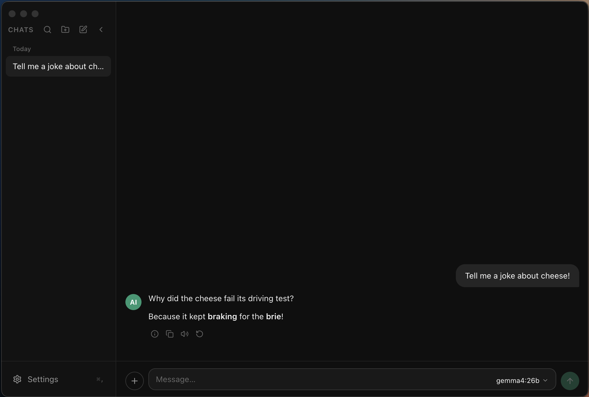
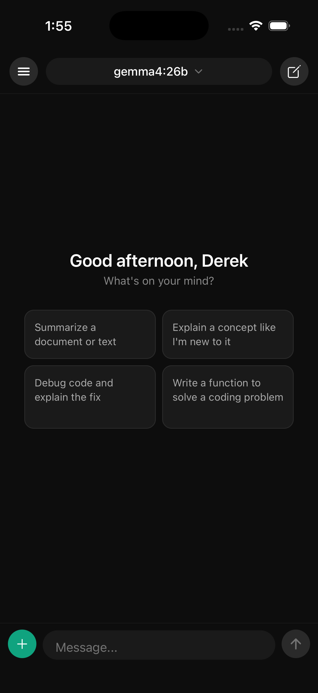

# OpenNativeUI (ONI)

A native client for [Open WebUI](https://github.com/open-webui/open-webui) — available as a React Native mobile app (iOS/Android) and an Electron desktop app (macOS, Windows, Linux).

<p align="center">
  
</p>
<p align="center">
  
</p>

This is a monorepo with three packages:

| Package | Path | Description |
|---|---|---|
| `@opennative/mobile` | `packages/mobile/` | Expo React Native app |
| `@opennative/electron` | `packages/electron/` | Electron desktop app |
| `@opennative/shared` | `packages/shared/` | Shared types, services, and stores |

---

## Prerequisites

- **Node.js** 20+
- **npm** 10+ (workspaces support required)
- **For mobile:** Xcode (iOS) and/or Android Studio (Android)
- **For mobile:** [Expo CLI](https://docs.expo.dev/more/expo-cli/) — `npm install -g expo-cli`
- A running [Open WebUI](https://github.com/open-webui/open-webui) instance to connect to

---

## Setup

Install all dependencies from the repo root — this covers all three workspaces:

```bash
npm install
```

---

## Mobile App (iOS / Android)

### Run in development

```bash
# iOS simulator
npm run mobile:ios

# Android emulator
npm run mobile:android

# Start Metro bundler only
npm run mobile:start
```

### Run on a physical device (release mode)

```bash
# iOS device (requires Apple Developer account + codesigning)
npm run mobile:ios:release
```

### Type checking

```bash
npm run mobile:typecheck
```

### Notes

- File-based routing via [Expo Router](https://docs.expo.dev/router/introduction/). All screens live under `packages/mobile/app/`.
- Storage uses [MMKV](https://github.com/mrousavy/react-native-mmkv) for fast, persistent on-device storage.
- Styling uses [NativeWind](https://www.nativewind.dev/) (Tailwind CSS for React Native).
- The Metro bundler is configured for monorepo mode — it watches the root workspace and resolves modules from both `node_modules` trees.

---

## Electron Desktop App

### Run in development

```bash
npm run electron:dev
```

This starts the `electron-vite` dev server with hot reload for both the main process and renderer.

### Build for production

```bash
# Compile production assets only
npm run electron:build

# Compile + package into a distributable (.dmg, .exe, etc.)
npm run electron:package
```

Packaged output goes to `packages/electron/dist-app/`.

### Type checking

```bash
npm run electron:typecheck
```

### Architecture

The Electron app uses a **two-window** setup:

- **Main window** (1200×800) — the full chat interface
- **Chat bar** (680×72, expandable) — an always-on-top floating HUD

The chat bar can be toggled with a global hotkey (default: `Alt+Space`) and positions itself centered on whichever screen your cursor is on.

**IPC bridges** (exposed via the preload script) give the renderer safe access to:
- File picker dialogs
- Reading files as base64
- Opening URLs in the system browser
- System theme (light/dark)
- File-backed persistent storage (`app-storage.json` in `userData`)

**Storage** in Electron is file-backed (`userData/app-storage.json`) so it survives hard exits and is immediately consistent across windows without needing localStorage.

### Notes

- Built with [electron-vite](https://electron-vite.org/) (Vite-based build for main/preload/renderer separation).
- Packaged with [electron-builder](https://www.electron.build/). macOS target is a universal DMG (arm64 + x64).
- Styling uses Tailwind CSS via PostCSS.
- Renderer routing uses [React Router v7](https://reactrouter.com/).
- Context isolation and sandboxing are enabled.

---

## Shared Package

`packages/shared/` is a TypeScript library consumed by both the mobile and electron apps. It contains:

- **Zustand stores** — auth, chat, conversations, folders, models, model preferences, settings
- **Services** — HTTP API client, conversation/folder/file APIs, Socket.IO management, SSE streaming
- **Hooks** — `useStreamingChat()`
- **Types** — all shared TypeScript types (`Message`, `Conversation`, `Model`, `ServerConfig`, etc.)
- **Abstractions** — `registerStorage()` and `registerSSEFactory()` allow each platform to inject its own storage and streaming implementations

Each app registers its platform-specific storage and SSE backends at startup, then the shared services use them transparently.

---

## All Root Scripts

| Script | Description |
|---|---|
| `npm run mobile:start` | Start Metro bundler |
| `npm run mobile:ios` | Build and run on iOS simulator |
| `npm run mobile:ios:release` | Release build for iOS device |
| `npm run mobile:android` | Build and run on Android emulator |
| `npm run electron:dev` | Run Electron in dev mode (hot reload) |
| `npm run electron:build` | Build production assets |
| `npm run electron:package` | Build + create distributable |
| `npm run typecheck` | TypeScript check across all packages |

---

## Configuration

There are no `.env` files. Each app is configured at runtime:

- **Server URL, auth token** — entered on first launch, persisted in Zustand + platform storage
- **Model preferences** — stored per-app in persistent storage
- **Chat bar hotkey** — stored in `userData/chatbar-config.json` (Electron only)

---

## Project Structure

```
OpenNativeUI/
├── packages/
│   ├── mobile/             # Expo React Native app
│   │   ├── app/            # Expo Router screens (file-based routing)
│   │   ├── src/
│   │   │   ├── components/
│   │   │   ├── hooks/
│   │   │   ├── lib/
│   │   │   ├── services/
│   │   │   └── stores/
│   │   ├── android/
│   │   ├── ios/
│   │   └── app.json
│   ├── electron/           # Electron desktop app
│   │   ├── src/
│   │   │   ├── main/       # Main process (Node.js)
│   │   │   ├── preload/    # Preload scripts (IPC bridge)
│   │   │   └── renderer/   # React UI
│   │   │       ├── components/
│   │   │       ├── screens/
│   │   │       ├── layouts/
│   │   │       ├── lib/
│   │   │       └── services/
│   │   └── electron-builder.yml
│   └── shared/             # Shared TypeScript library
│       └── src/
│           ├── config/
│           ├── hooks/
│           ├── lib/
│           ├── services/
│           └── stores/
├── docs/                   # Additional documentation
├── package.json            # Monorepo root (workspaces)
└── tsconfig.base.json      # Shared TypeScript config
```
